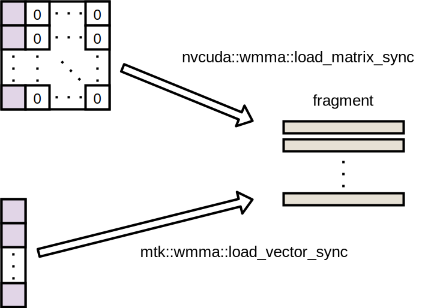
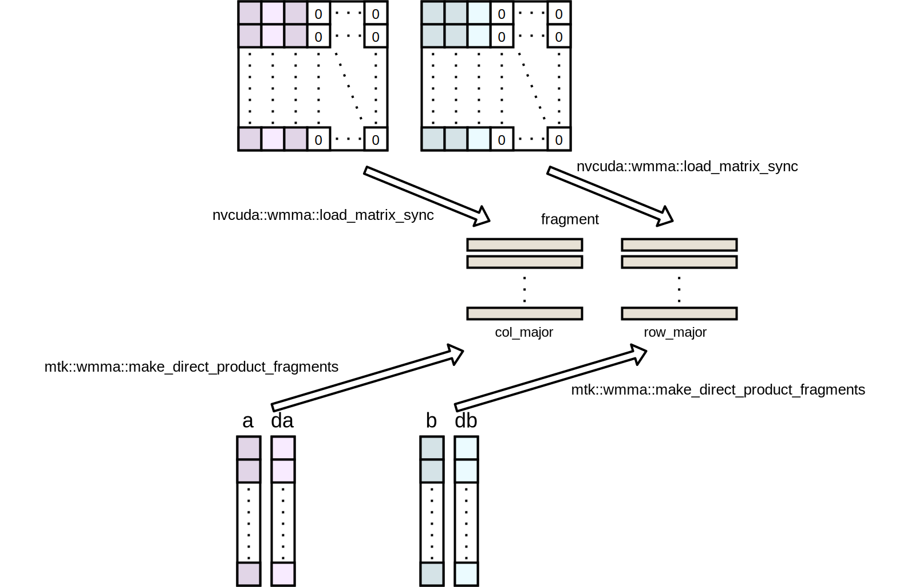

# WMMA API Extension
This extension provides a function for
- loading vector as a fragment
- making identity matrix fragment
- loading matrix with operation

without using extra shared memory.

## Required
- CUDA (9.2 or later)
- C++ (11 or later)

## Sample
```cuda
#include <mma.h>
#include <wmma_extension.hpp>

__global__ void kernel() {
	nvcuda::wmma::fragment<nvcuda::wmma::matrix_a, 16, 16, 16, half, nvcuda::wmma::col_major> frag_a;
	nvcuda::wmma::fragment<nvcuda::wmma::matrix_b, 16, 16, 16, half, nvcuda::wmma::col_major> frag_b;
	nvcuda::wmma::fragment<nvcuda::wmma::accumulator, 16, 16, 16, half> frag_b;

	__shared__ float vec16[16];

	mtk::wmma::load_vector_sync(frag_a, vec16);
	mtk::wmma::load_vector_sync(frag_b, vec16);

	mtk::wmma::make_identity_matrix(frag_c);
}
```

## Implemented functions
### load_vector_sync

- Arguments
  - dst_fragment : Destination fragment (`nvcuda::wmma::matrix_a` / `nvcuda::wmma::matrix_b`, (16, 16, 16), `half`, `nvcuda::wmma::col_major` / `nvcuda::wmma::row_major`)
  - src_pointer  : Source pointer (No alignment restriction)

### store_vector_sync

- Arguments
  - dst_pointer  : Destination pointer (No alignment restriction)
  - src_fragment : Source fragment (`nvcuda::wmma::accumulator` , (16, 16, 16), `half` / `float`)
  - layout       : `nvcuda::wmma::mem_col_major` / `nvcuda::wmma::mem_row_major`

### load_matrix_with_operation_sync
```cuda
nvcuda::wmma::fragment<nvcuda::wmma::matrix_b, 16, 16, 16, half, nvcuda::wmma::col_major> frag_b;
__shared__ compute_t matrix[16 * 16];
mtk::wmma::load_matrix_with_operation_sync(
		frag,
		matrix,
		[](const unsigned index, const compute_t value) -> half {return static_cast<half>(value * 2.0f);}
	);
```
- Arguments
  - dst_fragment : Destination fragment (matrix_a / matrix_b, (16, 16, 16), half / float, col_major / row_major)
  - src_pointer  : Source pointer (No alignment restriction)
  - func         : Element-wise function. Return type has to be `half`.

### make_direct_product_fragments
This function is used for computing direct product of two vectors (u and v) with accuracy correction.



- Arguments
  - frag_a : Destination fragment (`matrix_a`, (16, 16, 16), `half`, `col_major`)
  - frag_b : Destination fragment (`matrix_b`, (16, 16, 16), `half`, `row_major`)
  - u      : u (`float` / `half`)
  - du     : diff vector of `u` (`u` - toFloat(toHalf(`u`))) (`float` / `half`)
  - v      : v (`float` / `half`)
  - dv     : diff vector of `v` (`v` - toFloat(toHalf(`v`))) (`float` / `half`)

### make_identity_matrix

- Arguments
  - dst_fragment : Destination fragment (accumulator, (16, 16, 16), half / float)
  - alpha : diagonal element

### fill_zero
- Argument
  - dst_fragment : Destination fragment (float / half)

### print_fragment
This function output the elements of a fragment.
- Arguments
  - frag : Target fragment
  - name : printing name of fragment (`char*`)
